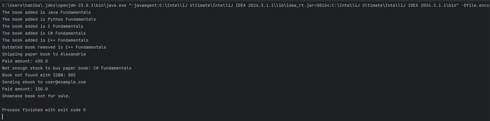

# Quantum Bookstore

Quantum Bookstore is a simple Java console-based application that simulates an online bookstore with different types of books and purchasing logic.

## Features

- Add books to inventory with details: ISBN, title, author, publish year, and price
- Three types of books:
  - **PaperBook**: has stock and is shipped to an address
  - **EBook**: has a file type and is sent to an email
  - **ShowcaseBook**: visible only, not for sale
- Buy a book by providing ISBN, quantity, email, and address
  - Checks stock availability
  - Reduces stock when purchased
  - Throws an error if book is not found or out of stock
- Remove outdated books published before a certain number of years
- All console output is prefixed with **Quantum book store**

## Technologies Used

- Java (OpenJDK 23)
- IntelliJ IDEA Ultimate
- OOP design (inheritance, abstraction)

## How to Run

1. Open the project in **IntelliJ IDEA**
2. Ensure SDK is set to Java 23
3. Navigate to `Main.java`
4. Right-click and choose **Run**
5. Console output will appear showing added books, purchases, and errors

## Screenshots

### App Running in IntelliJ


## Folder Structure

```
Quantum Bookstore/
├── src/
│   ├── Book.java
│   ├── PaperBook.java
│   ├── EBook.java
│   ├── ShowcaseBook.java
│   ├── BookStore.java
│   ├── ShippingService.java
│   ├── MailService.java
│   └── Main.java (testing class)
└── screenshot/
    └── output1.png
```

## Notes

- You can easily extend the system by adding new types of books without modifying the existing ones
- The application demonstrates key OOP principles including inheritance and polymorphism
- Error handling is implemented for common scenarios like out-of-stock items and invalid ISBNs

---
